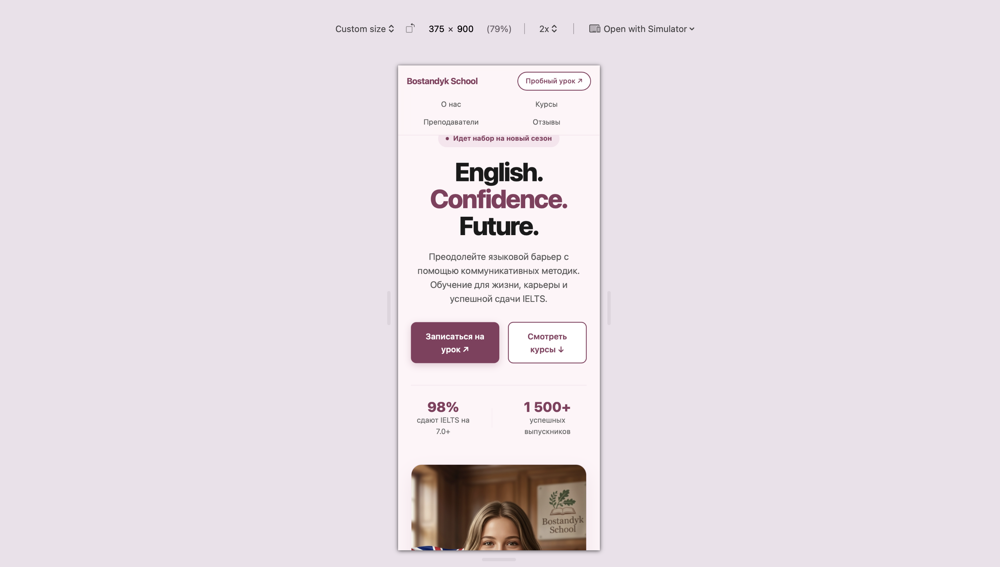
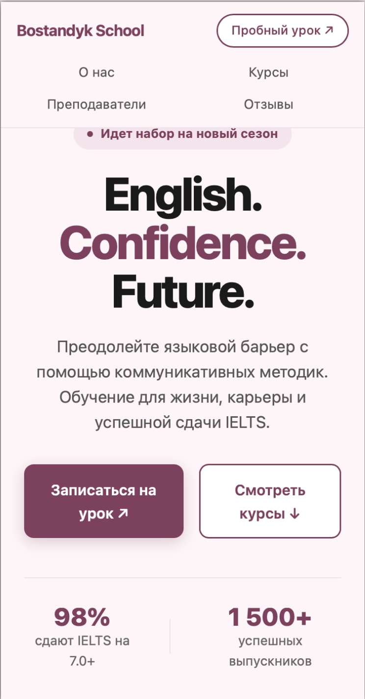
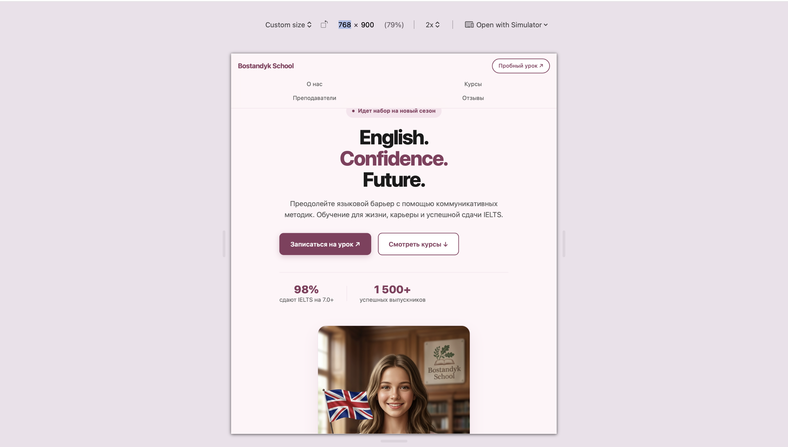
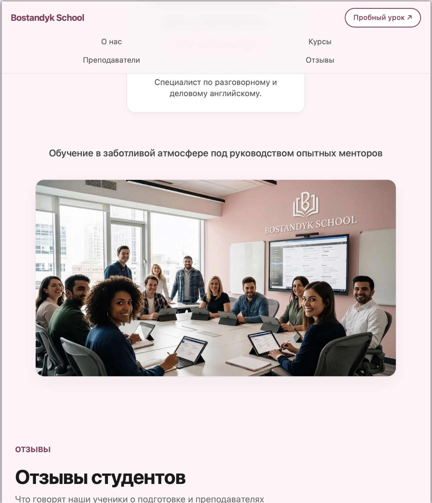
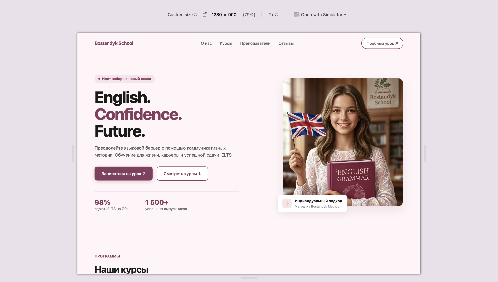
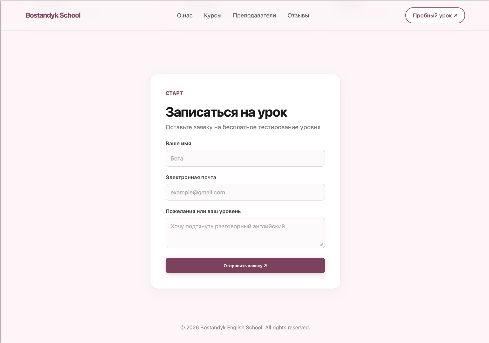

# Bostandyk School — Elegant English Language School (Laboratory Work №3)

- **GitHub Pages Link:** https://botacorre.github.io/landing-bostandyk/
- **Track:** C (Sass + BEM)

---

## AI Tools Usage
During the project, Gemini / ChatGPT / Claude were used for:
Layout & Styling: generating Sass, fixing Flexbox/Grid, and debugging the mobile menu.

---

## Responsiveness

### Phone (Screenshot: 375 px)

### Tablet (Screenshot: 768 px)

### Desktop (Screenshot: 1280 px)

---

## Why This Tool (Sass + BEM)

Combining the Sass preprocessor with the BEM methodology enabled a flexible and scalable styling structure. Extracting key color shades and typography into the `_variables.scss` file allowed for instant customization of the site's refined and elegant aesthetic. Using the custom `respond-to` mixin eliminated repetitive media queries and ensured precise control over breakpoints (375px, 768px, 1280px). The BEM methodology prevented any class name conflicts and kept the HTML markup clean. Unlike frameworks such as Tailwind or Bootstrap, Sass provides complete control over the final CSS file size without unnecessary bloat, though it requires a compilation step.

---

## Self-Check Requirements

- [x] No horizontal scrolling across any screen resolutions.
- [x] Images and blocks do not overflow the viewport boundaries.
- [x] All 3 width screenshots (375px, 768px, 1280px) are included in the `screenshots/` folder.
- [x] All buttons and links are functional and interactive.
- [x] AI tools utilized during development are specified.
- [x] At least 3 commits with meaningful messages were made.
